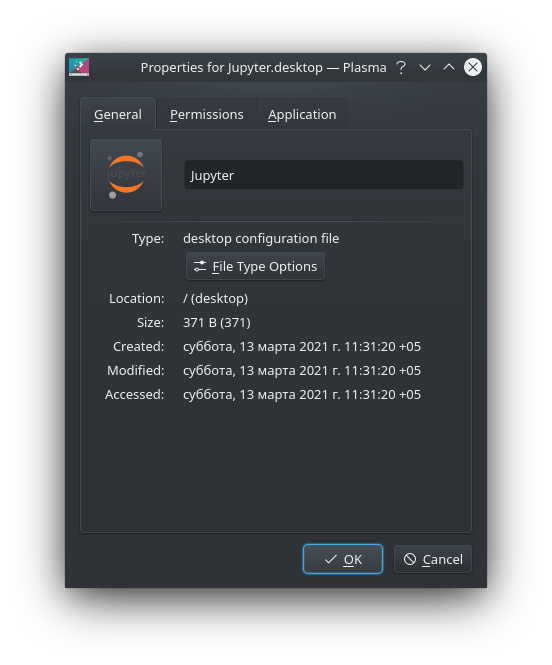
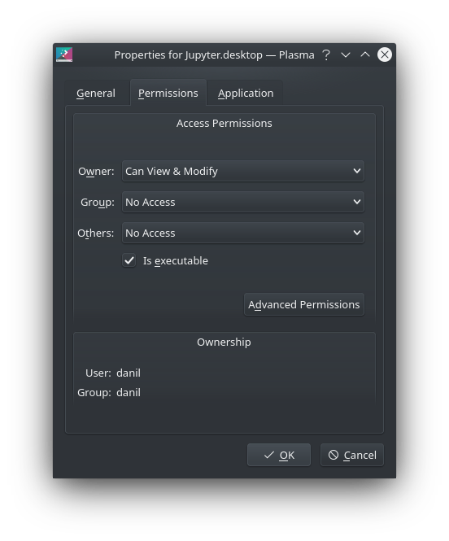
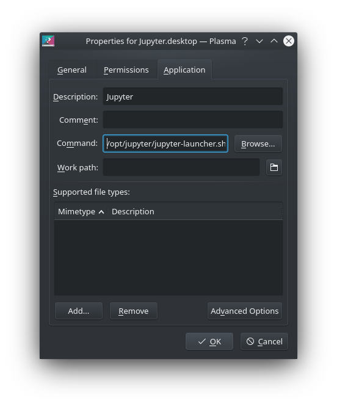

# Инструменты для программирования
## [Основные команды Linux](https://www.hostinger.com/tutorials/linux-commands)
```bash
# вывод пути текущей директории
pwd

# вывод содержимого каталога
ls
ls -lh
ls -lah
alias ls='ls -lh'

# перемещение по каталогам
cd Pictures
cd ..
cd ~

# создание и удаление каталогов
mkdir source
mkdir target
rm -rf {source,target}
mkdir {source,target}

# создание, копирование, перемещение файлов
cd source
touch example.file
cp example.file ~/target/
cd ~/target/
mv example.file ~/source/
cd ~/source/
rm example.file

# вывод строки текста в терминал и в файл
echo "print('Hello, World')"
echo "print('Hello, World', 2+2)" > main.py
cat main.py
python3 main.py
rm main.py

# вывод в консоль и редактирование содержимого файла
# создание псевдонимов
cd ~
cat .bashrc
nano .bashrc
echo "alias ls=\"ls -lh\"" >> .bash_aliases

# установка программ
sudo apt update
sudo apt install xclip git python3-venv graphviz
```

## [Основы работы с Git](https://git-scm.com/book/ru/v2)
```bash
# 1. Регистрация на GitHub

# 2. Создание и добавление на GitHub ssh-ключа
echo "alias xclip='xclip -selection clipboard'" >> ~/.bash_aliases
ssh-keygen -t ed25519 -C "dzitcer@sdvor.com"
cat ~/.ssh/id_ed25519.pub | xclip

# 3. Создание репозитория python-numpy-hello-world

# 4. Клонирование репозитория
git clone git@github.com:DanilZittser/python-numpy-hello-world.git

# 5. Работа с проектом
ls
cd python-numpy-hello-world/
python3 -m venv venv
source venv/bin/activate
pip3 install -U pip
pip3 install numpy
pip3 freeze | grep numpy > requirements.txt
cat requirements.txt
mkdir src
echo "import numpy as np; print(np.ones(shape=(10, 10), dtype=int).sum())"
python3 src/main.py

# 6. Фиксация изменений в проекте
git status
git add .
git commit -m "feat: numpy hello world"
git push
```

## [Jupyter Notebook](https://jupyter.org/)
```bash
# 1. Установка Jupyter Notebook
cd /opt
sudo mkdir jupyter
sudo chown -R $USER:$USER jupyter
cd jupyter
python3 -m venv venv
source ./venv/bin/activate
python3 -m pip install -U pip notebook || sudo /opt/jupyter/bin/python3 -m pip install -U pip notebook

# 2. Скрипт для запуска
echo "#!/bin/bash
source /opt/jupyter/venv/bin/activate
cd ~
jupyter notebook" >> jupyter-launcher.sh
chmod +x jupyter-launcher.sh
```

На рабочем столе → ПКМ → Create New → Link to Application

 |  | 
:-----: | :---------: | :---------:
